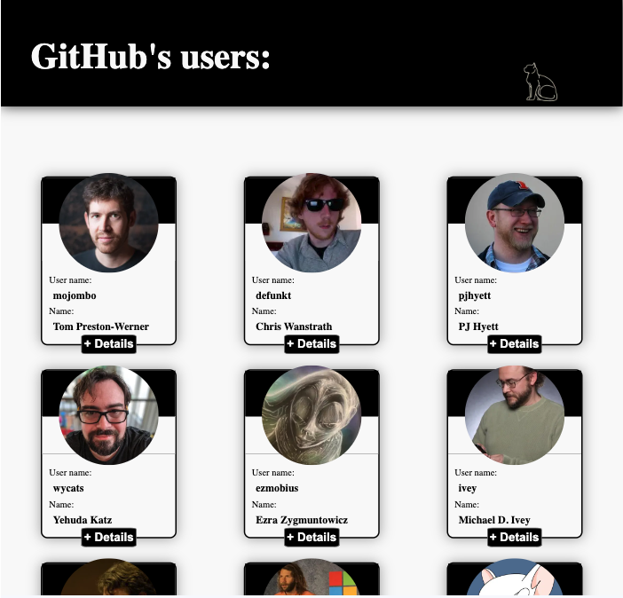

# GitHubUsers
Small GitHub Users App done in Next.js
A list with the firt 10 users from GitHub List are displayed. It is possible to click on each user card to get more details about the user.

In order to reduce API calls, the users and its details are stored in a context which is updated if the previos interaction with the app was more than onne hour ago. The followers and followings users displayed in a carousel on the moreDetails component, are not being stored in the context.

The website runs in one page which change the view between the usersList component and the moreDetails component depending on if there is any user's login storaged locally.

##To run this app:

1. Clone the repository and open it in your preferred source code editor.
2. Open your terminal and navigate to the project folder: cd GITHUBUSERS
3. Install the necessary dependencies: npm install
4. Run: npm run build
4. Run the client application: npm start
